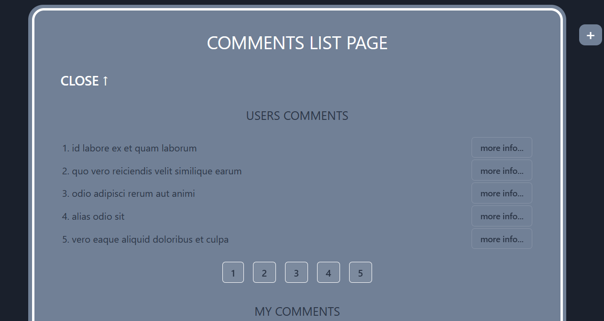

      

<h1 align="center">
      COMMENTS APP 
      
</h1>

## About
 In this App you can view user comments and add / edit / delete your comments
 
 Link to view this  App &#10143; https://kirlarionov.github.io/comments-app

## Functionality of the App
- Personal greeting in the App
- Getting user comments (from jsonplaceholder)
- Click on "read more" in a comment and go to the comment page
- Getting a page-by-page display of user comments
- Getting a list of your own comments (from mockAPI)
- You can edit and delete your comments
- Clicking on "+" you will go to the page of adding a new comment (the comment will be added to My Comments)
- You can sort your comment list by date and alphabetically (by comment name)
- You can set your own background (gears in lower left corner)
- You can choose a dark or light theme for the site
- Adaptive layout is implemented 
- If url is not found, "Page not found" page will open

## Technology stack

### Developers:
[Kirill Larionov (GitHub)](https://github.com/kirlarionov)
___
##### [
Back to top &#129145;
](#anchor)

